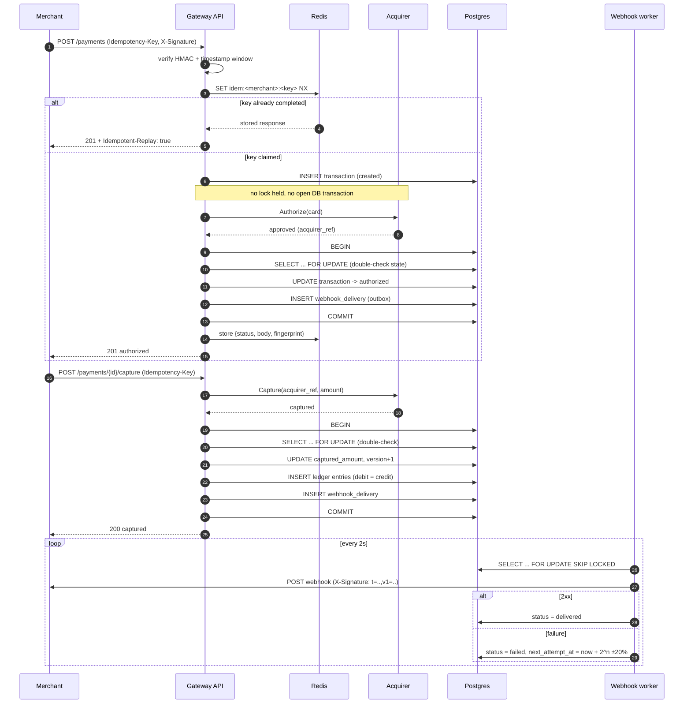

# Mini Payment Gateway

A small payment gateway in Go that behaves like the real thing: merchants call a signed HTTP API to authorize a card, the gateway orchestrates **authorize → capture → settle**, records every movement of money in a **double-entry ledger**, notifies merchants over **signed webhooks**, and **reconciles** the day before paying anyone out.

It is deliberately small in features and deliberately strict about three things that payment systems cannot get wrong: **idempotency**, **double-entry bookkeeping**, and **concurrency**.

---

## Contents

- [What it does](#what-it-does)
- [Payment flow](#payment-flow)
- [Run it in one command](#run-it-in-one-command)
- [API](#api)
- [Design decisions](#design-decisions)
- [Testing](#testing)
- [Numbers](#numbers)
- [Project layout](#project-layout)
- [What I would do next](#what-i-would-do-next)
- [Learning path](docs/learning-path.md) — a guided reading order for the codebase
- [Code reading order](docs/code-reading-order.md) — the same route function by function, with dependencies

---

## What it does

| Capability | Where it lives |
|---|---|
| HMAC-signed merchant API with replay protection | [internal/transport/http/middleware_auth.go](internal/transport/http/middleware_auth.go) |
| Idempotency on every money-moving POST | [internal/transport/http/middleware_idem.go](internal/transport/http/middleware_idem.go), [internal/idempotency/store.go](internal/idempotency/store.go) |
| Transaction state machine | [internal/domain/transaction.go](internal/domain/transaction.go) |
| Double-entry ledger, append-only | [internal/domain/ledger.go](internal/domain/ledger.go), [internal/repository/ledger_repo.go](internal/repository/ledger_repo.go) |
| Capture / refund / void with row locking | [internal/service/payment_service.go](internal/service/payment_service.go) |
| Simulated acquirer + circuit breaker | [internal/acquirer/](internal/acquirer/) |
| Webhook worker pool with retry and graceful shutdown | [internal/webhook/dispatcher.go](internal/webhook/dispatcher.go) |
| Daily reconciliation and settlement | [internal/service/reconciliation_service.go](internal/service/reconciliation_service.go) |

---

## Payment flow



More detail: [docs/architecture.md](docs/architecture.md) and [docs/payment-flow.md](docs/payment-flow.md).

---

## Run it in one command

Requires Docker and Go 1.22+.

```bash
cp .env.example .env
make up && make migrate && make seed
```

`make seed` prints a demo merchant's credentials — **including the `api_secret`, which is shown once and never again** — plus a ready-to-paste signed `curl`.

The seeded merchant's `webhook_url` defaults to `http://api:8080/internal/webhook-receiver`, which is how the API is reachable *from the worker container*. If you run the worker on the host with `make worker` instead, seed with `SEED_WEBHOOK_URL=http://localhost:8080/internal/webhook-receiver`.

```bash
export API_KEY=pk_test_...      # from the seed output
export API_SECRET=sk_test_...

./scripts/sign.sh GET /api/v1/merchants/me
./scripts/demo.sh               # authorize -> capture -> refund -> ledger
```

A raw `curl`, with the signature computed by hand:

```bash
TS=$(date +%s)
BODY='{"reference":"ORDER-2026-0001","amount":150000,"currency":"VND","card":{"number":"4242424242424242","exp_month":12,"exp_year":2028,"cvv":"123"},"capture":false}'
# The four components are joined by newlines -- see "Why the signed string is delimited".
SIG=$(printf '%s\n%s\n%s\n%s' "$TS" "POST" "/api/v1/payments" "$BODY" \
      | openssl dgst -sha256 -hmac "$API_SECRET" | awk '{print $NF}')

curl -sS http://localhost:8080/api/v1/payments \
  -H "X-Api-Key: $API_KEY" \
  -H "X-Timestamp: $TS" \
  -H "X-Signature: $SIG" \
  -H "Idempotency-Key: $(uuidgen)" \
  -H "Content-Type: application/json" \
  -d "$BODY"
```

### Test cards

| PAN | Behaviour |
|---|---|
| `4242424242424242` | normal path (configurable decline/timeout rates) |
| `4242424242420000` | always declined (`do_not_honor`) |
| `4242424242400002` | never answers, until the 3s context deadline fires |

All three are Luhn-valid, so they exercise the simulator rather than the input validation.

### Other commands

```bash
make run        # API only, against a local Postgres/Redis
make worker     # webhook delivery worker
make test       # unit tests, -race
make test-int   # integration tests against real Postgres + Redis
make test-cover # combined unit + integration coverage
make reconcile DATE=2026-08-27
make lint
```

No `make` on your machine (plain Windows, for instance)? Every target is a one-liner:

```bash
docker compose up -d --build                      # make up
go run ./cmd/migrate up                           # make migrate
go run ./cmd/seed                                 # make seed
go run ./cmd/api                                  # make run
go run ./cmd/worker                               # make worker
go run ./cmd/worker -job=reconcile -date=2026-08-27
go test ./... -race -cover                        # make test
go test ./test/integration/... -tags=integration -race -count=1
```

---

## API

Base path `/api/v1`. Every merchant-facing request carries:

```
X-Api-Key:   pk_test_...
X-Timestamp: <unix seconds>
X-Signature: <hex hmac_sha256(api_secret, "<timestamp>\n<method>\n<path>\n<body>")>
```

Only the path is signed, never the query string.

| Method | Path | Notes |
|---|---|---|
| POST | `/merchants` | admin only (`Authorization: Bearer $ADMIN_TOKEN`); returns the secrets once |
| GET | `/merchants/me` | |
| POST | `/payments` | requires `Idempotency-Key` |
| GET | `/payments/{id}` | |
| GET | `/payments` | filters: `status`, `from`, `to`; cursor pagination |
| POST | `/payments/{id}/capture` | full or partial; requires `Idempotency-Key` |
| POST | `/payments/{id}/void` | |
| POST | `/payments/{id}/refund` | full or partial; requires `Idempotency-Key` |
| GET | `/ledger/entries` | cursor pagination |
| GET | `/ledger/balance` | computed from the journal, never stored |
| GET | `/reports/settlement?date=YYYY-MM-DD` | |
| GET | `/healthz`, `/readyz` | liveness / readiness |

Errors always look like this, and every response carries `X-Request-Id`:

```json
{
  "error": {
    "code": "insufficient_funds",
    "message": "The card has insufficient funds.",
    "type": "card_error",
    "request_id": "req_01H..."
  }
}
```

`type` is one of `validation_error`, `authentication_error`, `card_error`, `idempotency_error`, `rate_limit_error`, `api_error`. The mapping from domain error to status code lives in exactly one place, [`response.go`](internal/transport/http/response.go), and is pinned by a table test.

---

## Design decisions

### Why a double-entry ledger instead of a balance column

A balance column answers *how much*, but never *why*. Every payment system eventually has to explain a number to a merchant, an auditor, or a regulator, and `UPDATE balance SET amount = amount + 98000` throws away the explanation the moment it runs.

Here, `ledger_entries` is append-only — there is no UPDATE and no DELETE, and a database trigger enforces that even against a direct `psql` session. A balance is a fold over the journal: `SUM(credit) - SUM(debit)` on `merchant_payable:<merchant_id>`. Every business event writes one *entry group* whose debits equal its credits, so the invariant `sum(debit) == sum(credit)` holds per group and therefore over the whole table. That single property is what makes reconciliation possible at all: a wrong number is always traceable to the group that produced it, and a correction is a new group, not a rewrite of history.

The cost is that reading a balance is an aggregate rather than a column read. At this scale it is a single index scan; past that, the fix is a materialised view refreshed at settlement, not a mutable balance.

### How idempotency works, and why the request fingerprint matters

Every money-moving POST requires an `Idempotency-Key`. The middleware computes `key = idem:<merchant_id>:<idempotency_key>` and claims it with a single `SET NX EX 86400` — atomic, so exactly one of N simultaneous retries wins. The winner runs the handler and then overwrites the key with `{status_code, response_body, request_fingerprint}`.

The fingerprint is a SHA-256 of the **canonicalised** body (JSON re-encoded with sorted keys), and it is the part people leave out. Without it, "same key" would mean "return whatever I returned last time", so a client that reuses a key by accident — a fixed key in a config file, a UUID generated once per process — would silently get someone else's answer, and a real second payment would vanish. With it, three outcomes are distinguishable:

- same key, same body → replay the stored response verbatim, `Idempotent-Replay: true`, handler never runs
- same key, different body → `422 idempotency_key_reuse`; a client bug, refused loudly
- same key, still running → `409 request_in_progress`; retry shortly

Canonicalisation matters because HTTP clients and proxies reorder JSON keys and change whitespace. Byte-comparing the body would report those as different requests and refuse legitimate retries.

A `5xx` or a panic **releases** the key. The outcome is unknown or our fault, and caching that answer for 24 hours would leave the merchant permanently unable to complete the payment.

### Why the acquirer is called outside the database transaction

The obvious implementation opens a transaction, `SELECT ... FOR UPDATE`, calls the card processor, and writes. It is also wrong. The processor call is network I/O with a 3-second timeout; holding a row lock and a pooled connection across it means one slow issuer serialises every other request touching that row and drains the connection pool. Under load, that is how a slow dependency becomes an outage.

So the flow is:

1. **Cheap pre-check** without a lock — is this transaction capturable at all? Reject the obvious mistakes before spending a network call.
2. **Call the acquirer** with no lock held and no transaction open, under `context.WithTimeout` and a circuit breaker.
3. **Short transaction**: `BEGIN`, `SELECT ... FOR UPDATE`, **re-apply the same domain rules to the row as it now is**, `UPDATE ... WHERE version = $n`, insert the ledger entries and the webhook outbox row, `COMMIT`.

Step 3 is the important one. The pre-check in step 1 is advisory — the row can change while we are on the network. The double-check inside the lock is what actually decides. Ten goroutines capturing the same transaction all reach step 3; the lock serialises them, and the second one through finds `RemainingCapturable() == 0` and fails. Exactly one entry group is ever written, which is asserted by a `-race` test in [test/integration/concurrency_test.go](test/integration/concurrency_test.go).

The honest trade-off: if the acquirer succeeds and the double-check then fails, money moved at the processor but not in our books. The code logs that at ERROR with the acquirer reference, and the daily reconciliation is what catches it. A real gateway resolves that against the processor's own settlement file — which is precisely why reconciliation exists rather than being an afterthought.

`version` gives optimistic locking on top of the pessimistic row lock: `rows_affected = 0` means someone else moved the row, and the in-memory copy must not be trusted. Belt and braces — the lock protects writers who take it, the version column catches anyone who did not.

### Why int64 minor units instead of float

`0.1 + 0.2 != 0.3` in binary floating point. A gateway that loses a cent per rounding loses trust faster than it loses money, and the error is not reproducible across languages or platforms. `int64` in minor units (VND: đồng, USD: cent) is exact, holds about 9.2 × 10¹⁸ units, and maps to `BIGINT` in Postgres with no conversion. Fee arithmetic is integer division that always truncates, so rounding never takes from the merchant: `Fee(amount, bps) = amount * bps / 10000`.

The type is named (`money.Amount`), not a bare `int64`, so an amount cannot be silently passed where a count belongs.

### Why the full card number is never stored

`transactions` holds `card_last4` and `card_brand`. The PAN, expiry and CVV exist only inside the request struct, are handed to the acquirer, and are dropped when the call returns. Nothing writes them to the database, and no log line contains them.

This is a deliberate PCI-DSS scoping decision: data you do not store cannot leak, cannot be subpoenaed out of a backup, and does not drag the database into the audit boundary. Storing a CVV after authorization is forbidden outright. The cost is that this gateway cannot do card-on-file charges without a tokenisation vault — which is the correct place for that problem, not the payments table.

### Why the signed string is delimited

The obvious signing recipe is `hmac(secret, timestamp + method + path + body)`. It is also ambiguous, and a unit test in this repo demonstrates it: the request `(path "/a", body "b")` and the request `(path "/ab", body "")` produce **identical** signed bytes, so one valid signature is simultaneously a valid signature for a different request. Whether that is reachable through the router today is not the point — a signature scheme whose safety depends on the current route table is not a signature scheme.

So the components are joined by a character that cannot appear in a timestamp, an HTTP method or a URL path:

```
<timestamp> \n <method> \n <path> \n <body>
```

That is the same reasoning behind AWS SigV4's canonical request and Stripe's `t.body` construction: canonicalise, delimit, then sign. The query string is deliberately excluded, so the server verifies against `r.URL.Path` and clients do not have to agree on parameter ordering.

### Why merchant secrets are encrypted, not hashed

The spec's `api_secret_hash` cannot work with HMAC request signing: verifying a signature means recomputing it, which requires the secret itself, and a bcrypt hash is one-way by construction. Choosing a hash would mean giving up signed requests for bearer tokens.

So secrets are stored as **AES-256-GCM ciphertext** (`api_secret_enc`, `webhook_secret_enc`), keyed by `SECRET_ENC_KEY`, which lives in the environment and not in the database. A stolen database dump is not enough to forge a request. The plaintext is returned exactly once, from `POST /merchants`, and no endpoint can retrieve it afterwards. In production the key belongs in a KMS with rotation; the envelope-encryption shape here is the same.

### Why webhooks go through an outbox table

The webhook row is inserted **in the same database transaction** as the money movement it announces. That makes two failure modes impossible: a webhook that announces a capture which was rolled back, and a capture that commits while the process dies before the HTTP call. The worker then polls with `FOR UPDATE SKIP LOCKED`, so several worker processes can run without stepping on each other, and a claim left behind by a killed worker is released by a janitor pass rather than being retried by everyone at once.

Signing follows Stripe's scheme — `X-Signature: t=<unix>,v1=<hex hmac_sha256(secret, "<t>.<body>")>` — with the timestamp *inside* the signed string. If it were only a header field, an attacker could replay a captured payload forever by rewriting `t`.

---

## Testing

```bash
make test       # unit, -race
make test-int   # integration against real Postgres + Redis
```

| Layer | What it proves |
|---|---|
| `internal/domain` | the state machine matrix (every from→to pair), money rules, ledger invariants. ≥85% coverage, enforced in CI |
| `internal/acquirer` | circuit breaker states; declines do **not** trip the breaker, timeouts do |
| `internal/transport/http` | the full error→status table; all four idempotency cases against a fake store |
| `internal/webhook` | signature verification, replay and tampering |
| `test/integration` | the real thing: real Postgres, real Redis, only the acquirer mocked |

The integration suite deliberately does **not** mock the database. A fake would not tell us whether `SELECT FOR UPDATE`, the unique constraint on `(merchant_id, reference)`, or the append-only trigger actually behave as designed — which is most of what this project is about.

Every integration scenario ends with the same assertion: **no entry group in the whole journal is unbalanced**.

The concurrency test spawns 10 goroutines capturing one transaction and asserts exactly one success and exactly one entry group, under `-race`.

---

## Numbers

Measured on this repository, not aspirational:

| Metric | Value |
|---|---|
| Docker image, api (distroless, static, `-s -w`) | **21.6 MB** |
| Docker image, worker | **20.1 MB** |
| Coverage over `internal/...` (unit + integration) | **81.8%** — CI fails below 70% |
| `internal/domain` coverage (unit only) | **97.3%** — CI fails below 85% |
| `internal/money` coverage | **100%** |
| Direct dependencies | **6**: chi, pgx, goose, go-redis, uuid, testify |

Coverage is measured across unit *and* integration tests with `-coverpkg=./internal/...`. A unit-only number would be 27% and would mean nothing: the service, repository and transport layers are deliberately tested against a real database rather than a mock, so their coverage only shows up when the integration suite runs.

Reproduce:

```bash
make docker-build && docker images mini-payment-gateway
make up && make test-cover
hey -n 2000 -c 50 -H "X-Api-Key: $API_KEY" ... http://localhost:8080/api/v1/payments
```

### Index measurements

Measured with `EXPLAIN (ANALYZE, BUFFERS)` at 1,000 seeded transactions, each index dropped inside a rolled-back transaction so both plans see the same data:

| Query | Without index | With index | Speed-up |
|---|---|---|---|
| List 25 payments for one merchant | 1.743 ms (39 buffers) | 0.488 ms (4 buffers) | **3.6×** |
| Webhook poll, steady state | 1.125 ms | 0.185 ms | **6.1×** |
| Balance for one of 20 merchants | 2.180 ms | 0.551 ms | **4.0×** |
| Reconciliation day scan | 0.962 ms | 0.829 ms | ~1× |

The last row is the interesting one, and so is the fact that the first naive measurement showed *no* benefit for two of these queries: on single-merchant, single-day seed data the planner correctly prefers a sequential scan, because an index matching nearly every row is worse than reading the table. The full write-up — including what that means for which indexes are worth keeping — is in [docs/architecture.md](docs/architecture.md#what-the-numbers-actually-say).

---

## Project layout

```
cmd/api        HTTP server
cmd/worker     webhook dispatcher; also `-job=reconcile`
cmd/migrate    embedded goose migrations
cmd/seed       demo merchant + sample transactions

internal/domain      entities and business rules; imports nothing above it
internal/repository  the only package that writes SQL
internal/service     orchestration; owns database transactions
internal/transport   HTTP: DTOs, middleware, handlers, error mapping
internal/acquirer    the card-processor port and its simulator
internal/webhook     signing and delivery
internal/idempotency Redis-backed request deduplication
```

Dependency rule: `transport → service → repository → domain`. `domain` imports nothing from the layers above it, which is why the state machine can be tested with no database in sight.

---

## What I would do next

- **Tokenisation vault** so card-on-file charges are possible without widening PCI scope.
- **Multi-currency settlement** with FX rates captured at authorization time; today a transaction is single-currency and settlement assumes the merchant is paid in it.
- **Refund of the platform fee** as a policy switch. Today the fee is kept on refund, which is a business decision hard-coded in `NewRefundEntryGroup`.
- **A real acquirer file-based reconciliation**: today the job compares our two records against each other, which catches internal drift but not a disagreement with the processor.
- **Materialised balances** refreshed at settlement, once the journal is large enough that the aggregate stops being cheap.
- **Outbox with LISTEN/NOTIFY** instead of a 2s poll, to cut webhook latency without hammering the database.
- **Per-endpoint rate limits and a token bucket** — the current fixed window can let through 2× the limit across a boundary.
- **Structured audit log** of every state transition, separate from the journal, for support tooling.
