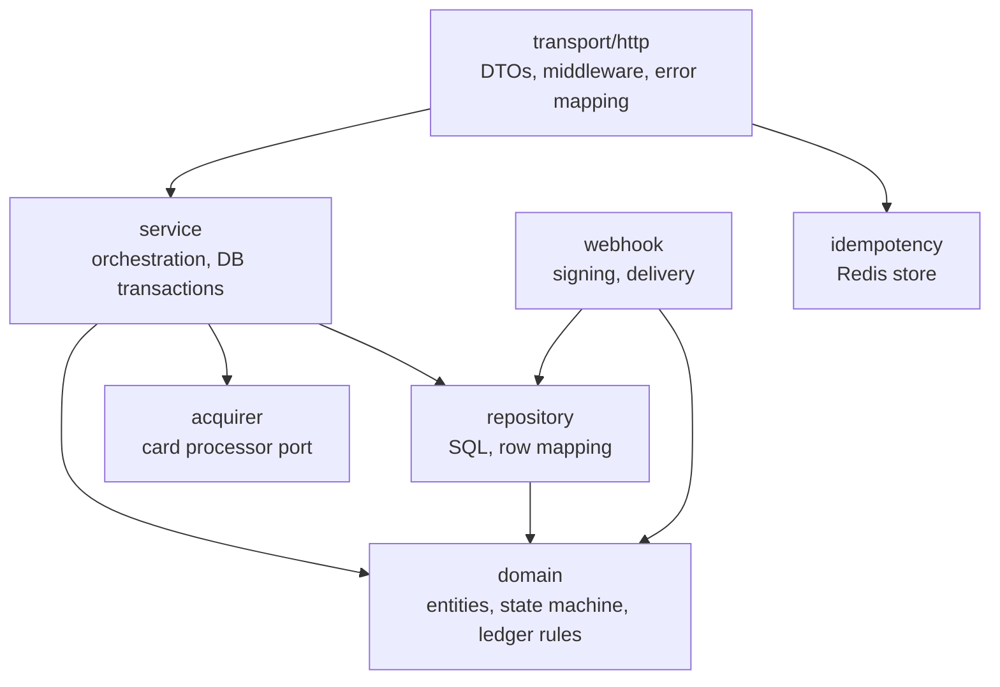
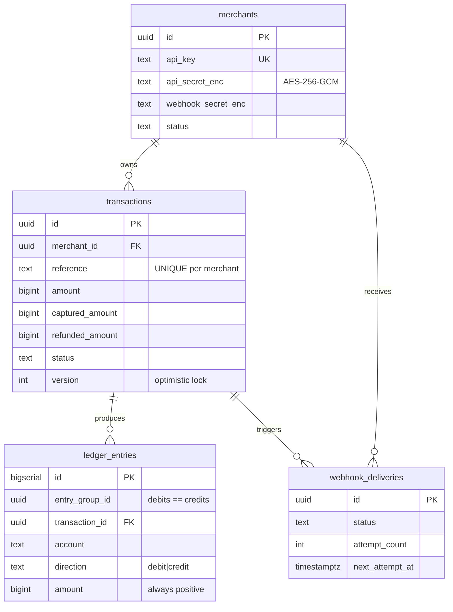

# Architecture

## Layers



The rule is one-directional: `transport → service → repository → domain`. `domain` imports nothing from the layers above it. That is not architectural decoration — it is why the transaction state machine and every money rule can be tested with no database, no HTTP server and no Redis, and why those tests run in milliseconds.

Interfaces are declared where they are **used**, not where they are implemented:

- `transport/http.Authenticator` and `transport/http.IdempotencyStore` are declared in the HTTP package, because that is what the middleware requires.
- `acquirer.Acquirer` is the port the service layer consumes; swapping the simulator for a real processor changes nothing above it.

No global variables (apart from sentinel errors), no `init()`, no service locator. The dependency graph is built once in [`internal/app/app.go`](../internal/app/app.go) and handed to constructors.

## Processes

| Process | Command | Responsibility |
|---|---|---|
| API | `cmd/api` | HTTP, authentication, idempotency, payment orchestration |
| Worker | `cmd/worker` | webhook delivery pool; `-job=reconcile` runs the daily close |
| Migrate | `cmd/migrate` | embedded goose migrations |
| Seed | `cmd/seed` | demo merchant and sample data |

The API and the worker share the same object graph but nothing at runtime except Postgres and Redis, so they scale and fail independently. The worker holds no state: everything it needs is a row in `webhook_deliveries`.

## Data model



### Chart of accounts

| Account | Type | Moves when |
|---|---|---|
| `acquirer_receivable` | asset | debited on capture, credited on refund |
| `merchant_payable:<merchant_id>` | liability | credited on capture, debited on refund and on settlement |
| `platform_fee_revenue` | revenue | credited on capture |
| `platform_cash` | asset | credited on settlement (cash leaves) |

A capture of 100,000 with a 2% fee:

| Account | Direction | Amount |
|---|---|---|
| `acquirer_receivable` | debit | 100,000 |
| `merchant_payable:<id>` | credit | 98,000 |
| `platform_fee_revenue` | credit | 2,000 |

A refund of 40,000 against it:

| Account | Direction | Amount |
|---|---|---|
| `merchant_payable:<id>` | debit | 40,000 |
| `acquirer_receivable` | credit | 40,000 |

The fee is **not** returned — the processing already happened — which is why a refund is not the mirror image of a capture. A fully refunded transaction therefore leaves the merchant balance at `-fee`, and that is correct: the merchant owes the platform the fee it already earned.

Settlement discharges the liability:

| Account | Direction | Amount |
|---|---|---|
| `merchant_payable:<id>` | debit | net payout |
| `platform_cash` | credit | net payout |

### Append-only enforcement

`ledger_entries` carries a `BEFORE UPDATE OR DELETE` trigger that raises an exception. Application discipline is not enough: a migration, a support script or a curious `psql` session must all bounce off the same wall. `TRUNCATE` still works (it does not fire row triggers), which is what lets the integration tests reset between scenarios.

## Concurrency model

Two mechanisms, doing different jobs:

**Pessimistic — `SELECT ... FOR UPDATE`.** Serialises writers to one transaction row. Everything in the capture write-back — read, re-validate, update, insert ledger entries, insert the webhook outbox row — happens inside one short database transaction while the lock is held.

**Optimistic — the `version` column.** `UPDATE ... WHERE id = $1 AND version = $2` returning zero rows means the row moved. It catches a writer who read the row without locking it, which the row lock cannot.

The acquirer call sits **outside** both. The ordering — pre-check, network call, then lock-and-double-check — is the central design decision of this project and is argued in [the README](../README.md#why-the-acquirer-is-called-outside-the-database-transaction).

For webhooks, `FOR UPDATE SKIP LOCKED` lets N worker processes drain one queue without queueing behind each other. Rows stuck in `delivering` for more than five minutes are released by the poller, which is what makes "kill the worker, lose no job" true rather than aspirational.

## Failure handling

| Failure | Response |
|---|---|
| Card declined | `402` with the acquirer's reason code; transaction → `failed`; no ledger entries |
| Acquirer timeout on authorize | `503`; transaction stays `created` (outcome unknown, not asserted as failed); a retry with the same reference resumes it |
| Acquirer down repeatedly | circuit breaker opens after 5 consecutive infrastructure failures, half-opens after 30s |
| Acquirer succeeded, double-check failed | ERROR log with the acquirer reference; reconciliation is the safety net |
| Redis down | rate limiting **fails open** (payments matter more than throttling); idempotency **fails closed** (a 5xx, because running without deduplication risks a double charge) |
| Worker killed mid-delivery | in-flight job runs to completion on a detached context; claimed-but-unstarted rows are released |
| Panic in a handler | recovered at the outermost middleware, idempotency key released, `500` with a request id |

## Query performance

Every index in [migration 00005](../migrations/00005_create_indexes.sql) carries a comment naming the query that needs it.

| Index | Query it serves |
|---|---|
| `transactions (merchant_id, created_at DESC, id DESC)` | `GET /payments` cursor pagination |
| `transactions (status, captured_at)` | reconciliation day scan |
| `ledger_entries (merchant_id, account, created_at DESC)` | `GET /ledger/balance` and `/ledger/entries` |
| `ledger_entries (entry_group_id)` | the invariant check |
| `ledger_entries (transaction_id)` | reconciliation join back to transactions |
| `webhook_deliveries (status, next_attempt_at) WHERE status IN (...)` | worker poll; partial, so it stays small as delivered rows accumulate |

### Measured before and after

Postgres 16 in Docker, `SEED_TRANSACTIONS=1000` (1,000 transactions, 2,900 journal lines, 2,100 outbox rows), `ANALYZE` run first, each index dropped inside a `BEGIN … ROLLBACK` so the comparison is against the same data.

| Query | Without index | With index | Speed-up | Plan change |
|---|---|---|---|---|
| List 25 payments for one merchant | **1.743 ms** (39 buffers) | **0.488 ms** (4 buffers) | **3.6×** | Seq Scan + top-N heapsort → Index Scan |
| Webhook poll, steady state (20 due of 2,100) | **1.125 ms** | **0.185 ms** | **6.1×** | Seq Scan, 2,080 rows filtered → Index Scan on the partial index |
| Balance for one of 20 merchants (21,900 journal rows) | **2.180 ms** | **0.551 ms** | **4.0×** | Seq Scan, 20,900 rows filtered → Bitmap Index Scan |
| Reconciliation day scan | **0.962 ms** | **0.829 ms** | ~1× | Seq Scan either way |

Reproduce:

```bash
SEED_TRANSACTIONS=1000 make seed
docker compose exec postgres psql -U gateway -d gateway -c "
  EXPLAIN (ANALYZE, BUFFERS)
  SELECT * FROM transactions
   WHERE merchant_id = '<id>'
   ORDER BY created_at DESC, id DESC
   LIMIT 25;"
```

### What the numbers actually say

Three findings worth more than the speed-ups themselves:

**Selectivity is the whole story, and freshly seeded data hides it.** Measured naively — one merchant, one day, nothing delivered yet — the balance query and the webhook poll showed *no* benefit at all: the planner chose a sequential scan even with the index present, and it was right to. An index that matches almost every row is slower than reading the table. The numbers above for those two queries were taken against data shaped the way production is shaped: many merchants sharing the journal, and a queue where nearly everything is already delivered. An index benchmark on a single-tenant, single-day fixture measures the fixture.

**The partial index earns its keep precisely because the table grows and the working set does not.** `webhook_deliveries` accumulates delivered rows forever, while the due set stays small. `WHERE status IN ('pending','failed')` keeps the index proportional to the work outstanding rather than to the history, which is why the gap widens over time instead of closing.

**`idx_transactions_status_captured_at` does not pay for itself yet, and that is fine.** Every row in this dataset was captured today, so the planner correctly ignores it. It exists for the case the job is actually written for — scanning one day out of months of history — which this seed cannot produce. Keeping an index that today's data does not exercise is a deliberate bet on the access pattern, not an oversight; the honest thing is to say so rather than quote a speed-up that was not measured.

### Known limitations

- **Balance is an aggregate.** Cheap at this scale, an index scan; past a few million entries the fix is a materialised view refreshed at settlement, not a mutable balance column.
- **Reconciliation attributes activity by `captured_at`.** A refund of yesterday's capture belongs to yesterday's batch. Both sides of the comparison slice the day the same way, so it is consistent — but a real system would carry an explicit accounting date per event.
- **The fixed-window rate limiter** can allow up to 2× the limit across a window boundary. Accepted: one `INCR` per request, no Lua, bounded burst.
- **The reconciliation job compares our two records against each other.** It catches internal drift, not a disagreement with the processor. A real gateway ingests the acquirer's settlement file and compares against that.
