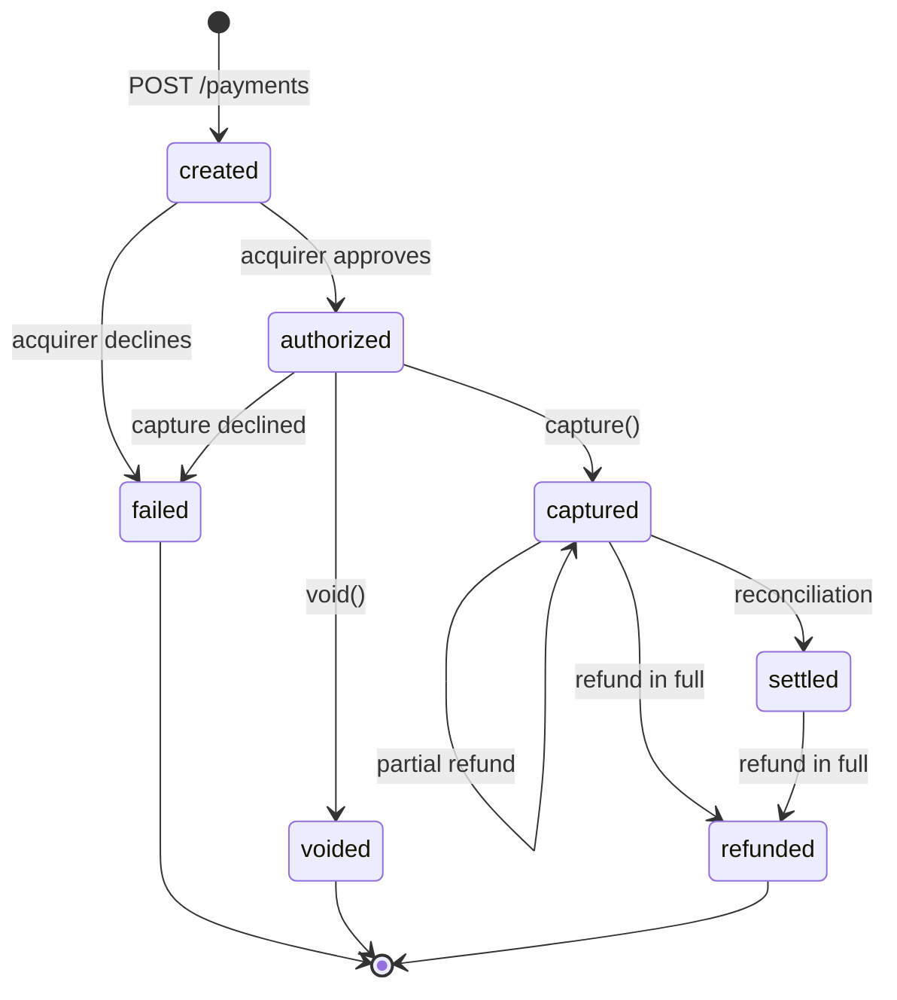
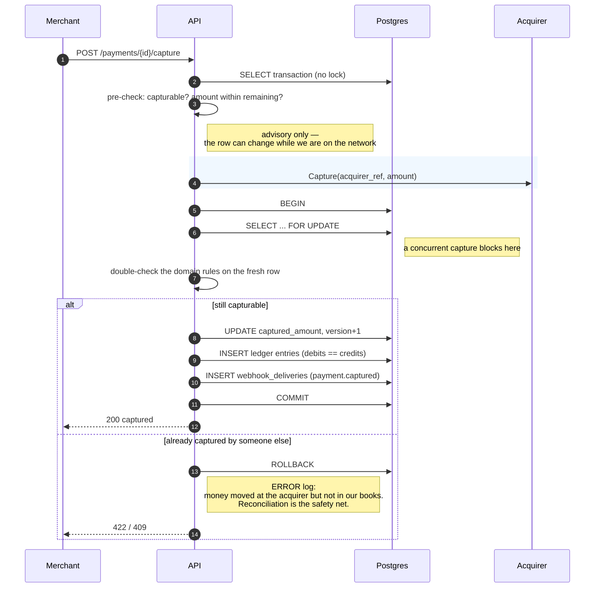
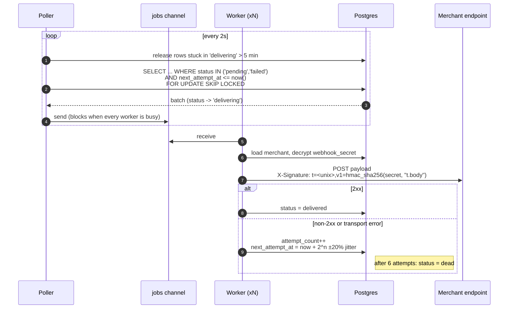
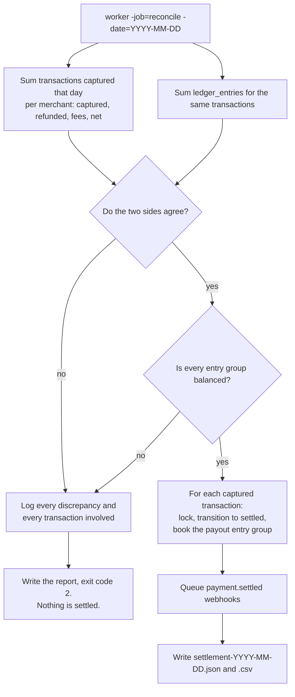

# Payment flow

## Transaction state machine

Implemented in [`internal/domain/transaction.go`](../internal/domain/transaction.go). Every status change goes through `TransitionTo`; there is no direct assignment to `Status` anywhere else in the codebase.



Rules layered on top of the transitions:

- `captured_amount` may never exceed `amount` — enforced in the domain **and** by a `CHECK` constraint.
- `refunded_amount` may never exceed `captured_amount` — same, twice.
- An authorization older than 7 days cannot be captured (`ErrAuthorizationExpired`).
- A partial refund leaves the status alone; only a refund that brings `refunded_amount` up to `captured_amount` reaches the terminal `refunded` state. Otherwise "refunded" would mean two different things.
- A transaction with any captured amount cannot be voided — that is what refund is for.

## Authorize

```mermaid
sequenceDiagram
    autonumber
    participant M as Merchant
    participant API
    participant R as Redis
    participant DB as Postgres
    participant A as Acquirer

    M->>API: POST /payments
    API->>API: verify HMAC (timestamp + method + path + body)
    API->>API: reject if |now - timestamp| > 5 min
    API->>R: SET idem:<merchant>:<key> NX EX 86400

    alt key completed with the same fingerprint
        API-->>M: stored response, Idempotent-Replay: true
    else key in progress
        API-->>M: 409 request_in_progress
    else key completed with a different fingerprint
        API-->>M: 422 idempotency_key_reuse
    else claim won
        API->>DB: INSERT transaction (created)
        Note over DB: UNIQUE (merchant_id, reference)<br/>rejects a duplicate order here,<br/>before any money is touched

        rect rgb(240, 248, 255)
            Note over API,A: no lock held, no transaction open
            API->>A: Authorize(amount, card)
        end

        alt approved
            API->>DB: BEGIN
            API->>DB: SELECT ... FOR UPDATE
            API->>DB: re-check status == created
            API->>DB: UPDATE -> authorized, version+1
            API->>DB: INSERT webhook_deliveries (payment.authorized)
            API->>DB: COMMIT
            API->>R: store {201, body, fingerprint}
            API-->>M: 201 authorized
        else declined
            API->>DB: UPDATE -> failed (failure_code)
            API->>DB: INSERT webhook_deliveries (payment.failed)
            API->>R: store {402, body, fingerprint}
            API-->>M: 402 + reason code
        else no answer (timeout)
            Note over API: status stays `created`.<br/>The hold may or may not exist;<br/>asserting failure would be a lie.
            API->>R: DEL key (releases the claim)
            API-->>M: 503 acquirer_unavailable
        end
    end
```

## Capture

The shape that matters: **pre-check → network → lock and re-check → write**.



## Webhook delivery



On `SIGINT`/`SIGTERM`: the poller stops first so no new rows are claimed, the channel closes, and workers finish what they hold on a context detached from the shutdown signal — bounded by the HTTP client timeout and a 30s overall deadline. A job is either completed or released; never abandoned half-done.

### Verifying a webhook, as a merchant

```
X-Signature: t=1756288800,v1=5257a869e7ecebeda32affa62cdca3fa51cad7e77a0e56ff536d0ce8e108d8bd
```

```go
mac := hmac.New(sha256.New, []byte(webhookSecret))
mac.Write([]byte(timestamp))
mac.Write([]byte("."))
mac.Write(body)
expected := hex.EncodeToString(mac.Sum(nil))

// constant time, and reject anything older than your tolerance
ok := hmac.Equal([]byte(expected), []byte(v1)) && time.Since(signedAt) < 5*time.Minute
```

The timestamp is part of the signed string, so rewriting it to defeat the freshness check invalidates the signature.

## Reconciliation and settlement



The non-zero exit code is what makes the job usable from cron: a day that does not reconcile is a day somebody has to look at, and settlement does not run on numbers nobody has checked.
